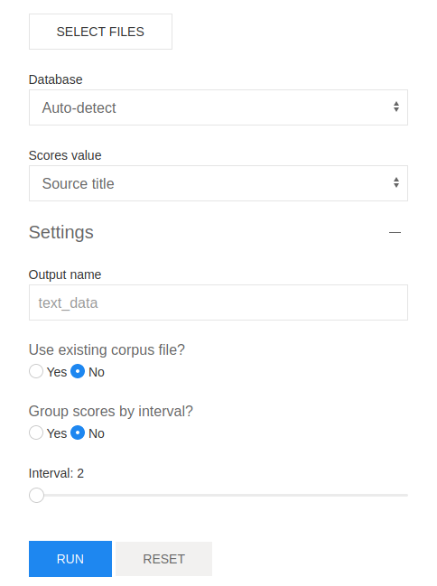

# VOSviewer Scores

Generate scores files for VOSviewer in a friendly, browser-based user interface.

### Setup
- Make sure Python is installed.
- Download or clone this repository.
- From the project folder install dependencies by running `pip install --user -r requirements.txt`.

### Run the application
- Start the local server from the project folder by running `python3 app.py` or `python app.py`.
- In a browser go to the address [http://127.0.0.5:5000](http://127.0.0.5:5000).

### Preview

